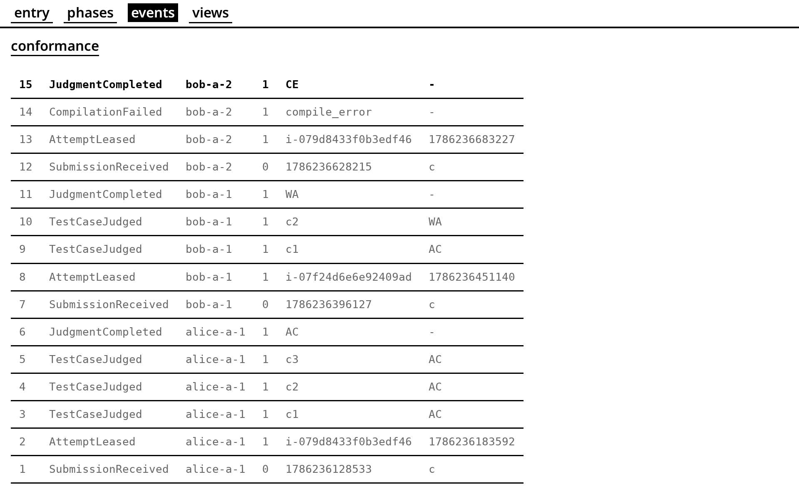
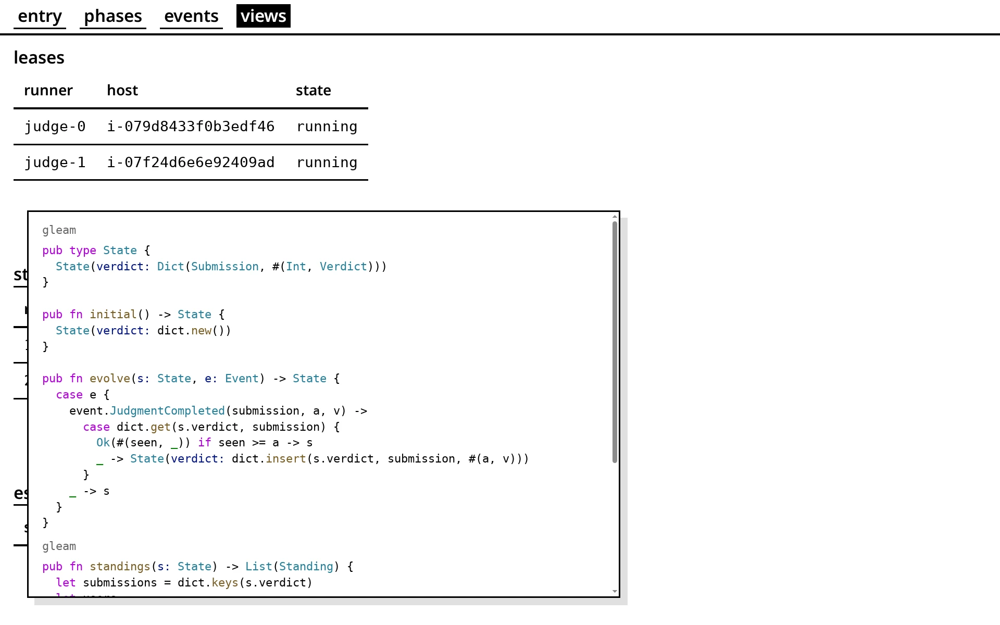

# 📜 Functional Event Sourcing

DEMOjudge はイベントソーシングを採用している．
イベントソーシングでは，現在の状態を単一のオブジェクトとして永続化しない．
代わりに，状態に変化があるたびに，その変化を表すイベントを永続化する．

実際，ノードはイベントの追記と読み取りの権限しか持たない．イベントの上書きと削除は禁止されている．

https://github.com/hayatroid/DEMOjudge/blob/f426125cafd4840219c1a9a07650128fdb7c6e05/aws/main.tf#L205-L218

## Events

デモの events はデータベース (DynamoDB) の中身そのものである．



イベントの一覧は次の通り．

https://github.com/hayatroid/DEMOjudge/blob/f426125cafd4840219c1a9a07650128fdb7c6e05/src/domain/submission/event.gleam#L20-L42

## Reader (View)

このイベント列を畳み込んで状態を組み立てるのが読み手である．
デモの views > standings を開くと，順位表を組み立てる畳み込みが載っている．



ビューはどれも同じイベント列を畳み込む．
異なるのは，初期状態をどう持つか (initial) と，イベント 1 つをどう畳み込むか (evolve) である．
例えば views > escalations は，同じイベント列から未解決のエスカレーションの一覧を組み立てる．

```gleam
// src/app/view/escalations.gleam
pub fn initial() -> State {
  State(escalated: dict.new())
}

pub fn evolve(s: State, e: Event) -> State {
  case e {
    event.SubmissionEscalated(submission, allowance, reason) ->
      State(escalated: dict.insert(
        s.escalated,
        submission,
        Escalation(submission, allowance, reason),
      ))
    event.EscalationResolved(submission, _) ->
      State(escalated: dict.delete(s.escalated, submission))
    _ -> s
  }
}
```

## Writer (Decider)

同じイベント列を畳み込んで，新しいイベントを発行するのが書き手である．

イベントを引き起こす入力をコマンドと呼ぶ．

```gleam
// src/domain/submission/command.gleam
pub type Command {
  Submit(submission: Submission, lang: String, at: Int)
  Resolve(submission: Submission, reason: String)
}
```

書き手の状態も，ビューと同じ形 (initial / evolve) の畳み込みでつくられる．
異なるのは decide が付くことで，畳み込んだ状態に照らして，コマンドからイベントを発行するか，拒否するかを決める．

```gleam
// src/domain/submission/fold.gleam
pub fn initial() -> State
pub fn evolve(s: State, e: Event) -> State

// src/domain/submission/command.gleam
pub fn decide(
  command: Command,
  state: fold.State,
) -> Result(List(Event), Rejection)
```

## 参考

- [Functional Event Sourcing Decider](https://thinkbeforecoding.com/post/2021/12/17/functional-event-sourcing-decider)
- [fraktalio/fmodel](https://github.com/fraktalio/fmodel)
