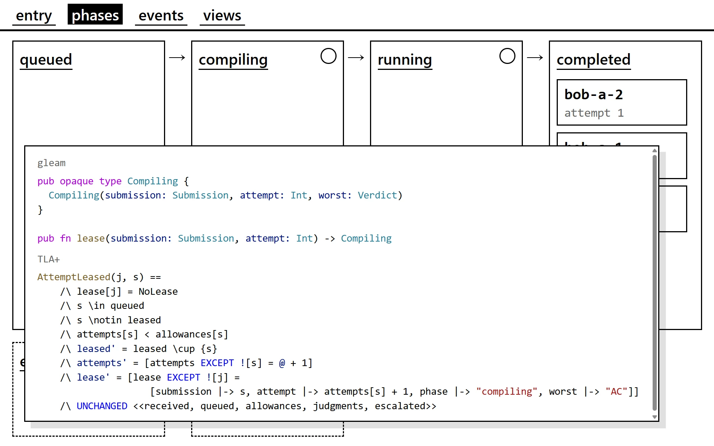

# 🔍 Model Checking

DEMOjudge は提出 1 件のライフサイクルを TLA+ で表している．

デモの各フェーズを開くと，対応する TLA+ の遷移が載っている．
遷移の名前は，そのとき書かれるイベントの名前である．

故障も 1 つの遷移である．
Crash はジャッジが途中で途絶える遷移で，これだけはイベントを書かない．

Crash を含めて起こりうる実行をすべて探索し，次の 2 つを [CI](https://github.com/hayatroid/DEMOjudge/actions/workflows/model-checking.yml) で確かめ続けている．

- 提出は失われない (always)．
- 提出はいずれ，判定を与えられるか，判定を与えられないとしてエスカレーションされる (eventually)．

https://github.com/hayatroid/DEMOjudge/blob/f426125cafd4840219c1a9a07650128fdb7c6e05/spec/DEMOjudge.tla#L165-L169

仕様の全文は次の通り．

https://github.com/hayatroid/DEMOjudge/blob/f426125cafd4840219c1a9a07650128fdb7c6e05/spec/DEMOjudge.tla#L1-L177

## 参考

- [My TLA+ Home Page](https://lamport.azurewebsites.net/tla/tla.html)
